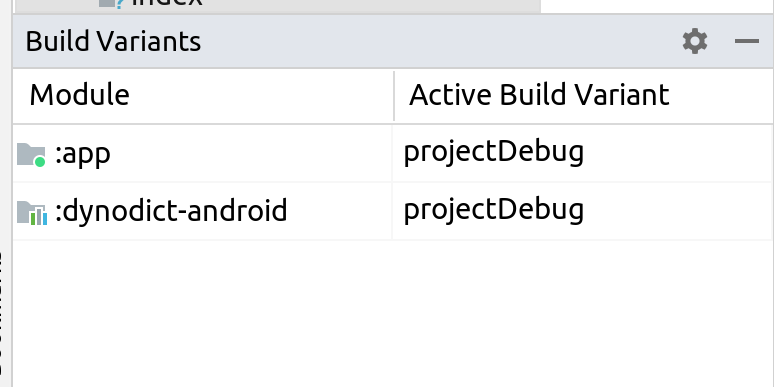

# DynoDict


### First run

In order to run the sample - choose projectDebug for both :app and :dynodict-android modules.


### Run using dependency from local maven
1. Deploy to MavenLocal:
    1. Open app/build.gradle.kts
    2. Comment out line:
   ``` 
   id("org.dynodict.plugin") version Versions.dynodictPlugin
   ```
    3. Run
   ```
   ./deploy.sh
   ```
    4. Sync and run using mavenDebug

### Description

This is the SDK to generate and update the list of Strings used in your project.
Use plugin to generate Kotlin placeholders for strings. For example:

```
{
    "translations": [
        {
            "key": "LoginScreen.ButtonName",
            "params": [
                {
                    "type": "string",
                    "key": "param1"
                },
                {
                    "type": "long",
                    "key": "param2",
                    "format":"startDate"
                }
            ],
            "value": "Log in {param1} ({param2})"
        }
    ]
}
```

is converted into:

```
object LoginScreen : StringKey("LoginScreen") {
    object ButtonName : StringKey("ButtonName", LoginScreen) {
        fun get(param1: String, param2: Long): String {
            return DynoDict.instance.get(
                this,
                Parameter.StringParameter(param1, key = "param1"),
                Parameter.LongParameter(param2, key = "param2", format = "startDate"))
        }
    }
}
```

and can be used further in code:

```
 val loginButtonName = LoginScreen.ButtonName.get("Param1", time)
```

### Plugin usage

1. Apply plugin:
   ```
   plugins {
       id 'org.dynodict.plugin'
    }
   ```
2. run gradlew script
   ```
   ./gradlew clean :app:downloadStrings --package=org.dynodict --url=metadata_url 
   ```

This task will download metadata from *metadata_url* and will generate Kotlin file Strings.kt
with Kotlin placeholders as well as json/yaml buckets.

3. Enjoy!

### Task customization

For :downloadStrings there is only one mandatory parameters which need to be passed:

_--url_ - Url where to get the data from.

There are some _optional_ parameters which can be used:

_--package_ - package which should be used to place Kotlin files. It is also
used to set package at the top of the file. Default is evaluated based on the first non-single
folder

_--source_ - location where generated Kotlin file should be placed to. Default src/main/java

_--assets_ - location of the assets folder where default .json files are placed to


